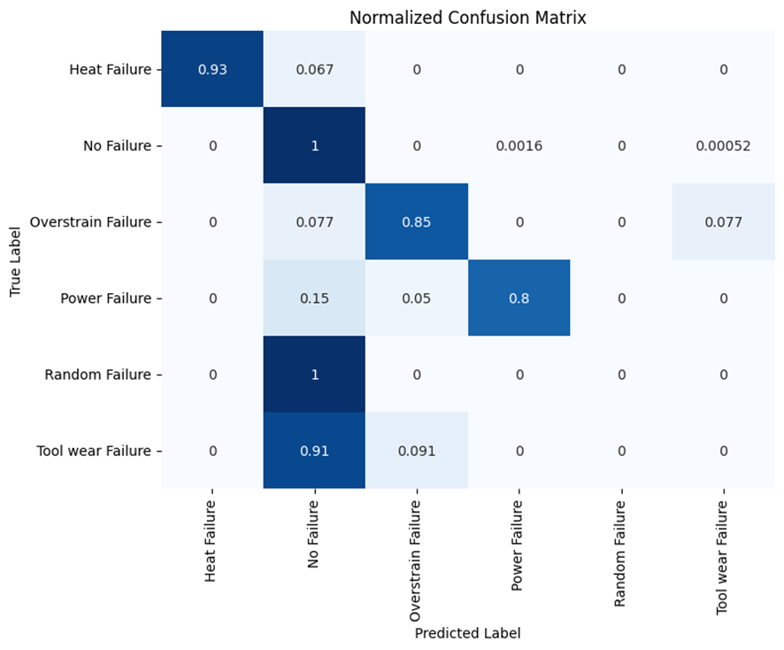
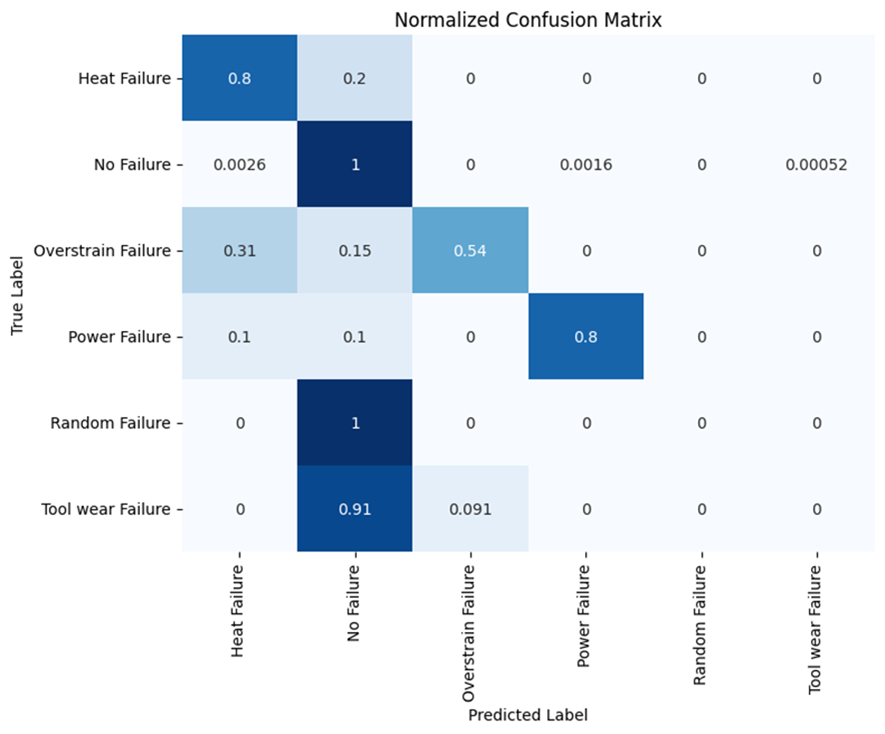
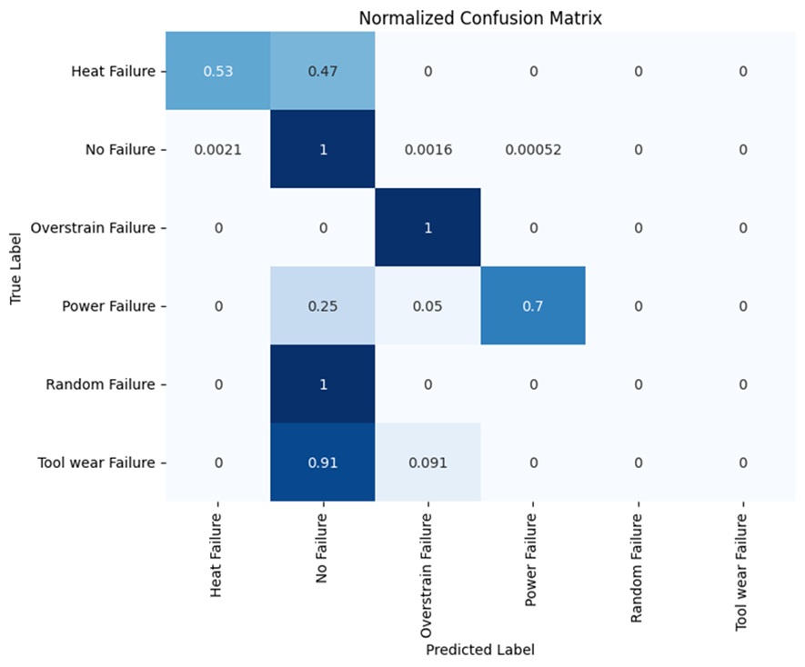

# Machine failure classification

Version: 0.1.0

This repository contains code and resources for predicting machine failures using machine learning techniques.

- [Machine failure classification](#machine-failure-classification)
  - [Project Overview](#project-overview)
  - [Project Organization](#project-organization)
  - [Results](#results)
    - [Gradient Boosting](#gradient-boosting)
    - [Random Forest](#random-forest)
    - [Neural Network](#neural-network)
    - [Comparison](#comparison)
  - [About](#about)
  - [Useful links](#useful-links)

## Project Overview

The goal of this project is to develop a machine learning model that can predict machine failures based on sensor data. This can help in proactive maintenance and reducing downtime in industrial settings.

The [dataset](https://archive.ics.uci.edu/dataset/601/ai4i+2020+predictive+maintenance+dataset) used for this project consists of sensor data collected from machines. Each record includes various sensor readings and a label indicating what type of failure occurred.

The training of the models is carried out with the help of MLflow. The results can be found [here](
https://dagshub.com/JonaKoenemann/machine_failure_classification.mlflow/#/experiments/0?searchFilter=&orderByKey=attributes.start_time&orderByAsc=false&startTime=ALL&lifecycleFilter=Active&modelVersionFilter=All+Runs&datasetsFilter=W10%3D).

## Project Organization

The project structure when using all features is as follows:

    ├── data               <- Folder for storing your data
    ├── results            <- Folder for saving results
    |
    ├── src                <- Source code for use in this project
    │   ├── data           <- Scripts to download or generate data
    │   └── models         <- Scripts to train models and then use trained models to make
    │                         predictions
    │
    ├── .gitignore                  <- Specifies intentionally untracked files to ignore
    ├── .pre-commit.config.yaml     <- Configuration file for the pre-commits
    ├── poetry.lock                 <- Autogenerated file for handling dependencies
    ├── pyproject.toml              <- Configuration of dependencies and project variables e.g. version
    └── README.md                   <- The top-level README for developers using this project.

## Results

### Gradient Boosting

- "No Failure" is classified completely correctly
- "Heat Failure", "Overstrain Failure" & "Power Failure" are reliably classified
- Random Failure" and "Tool wear Failure" are practically not recognised at all

### Random Forest

- "No Failure" is classified completely correctly
- "Heat Failure" and "Power Failure" are recognised very well
- "Overstrain Failure" recognised significantly worse than with the gradient boosting classifier
- "Random Failure" and "Tool wear Failure" are practically not recognised at all

### Neural Network

- "No Failure" and "Overstrain Failure " are classified completely correctly
- Performance of "Heat Failure" has dropped significantly
- "Random Failure" and "Tool wear Failure" are practically not recognised at all

### Comparison

| Model                         | Weighted F1 Score  |
|-------------------------------|--------------------|
| Naive Estimator               | 0.9515             |
| Gradient Boosting Classifier  | **0.9822**         |
| Random Forest Classifier      | 0.9785             |
| Neural Network                | 0.9764             |

As can be seen in the table, the Gradient Boosting classifier provides the best results. In addition, all 3 models tested provide a better performance than the naive estimator.

## About
Authors: Noah Kornter, Jona Koenemann

This project is based on the [python template](https://github.com/JonaKoenemann/python_template) of       [JonaKoenemann](https://github.com/JonaKoenemann).

## Useful links
[Python template](https://github.com/JonaKoenemann/python_template)
